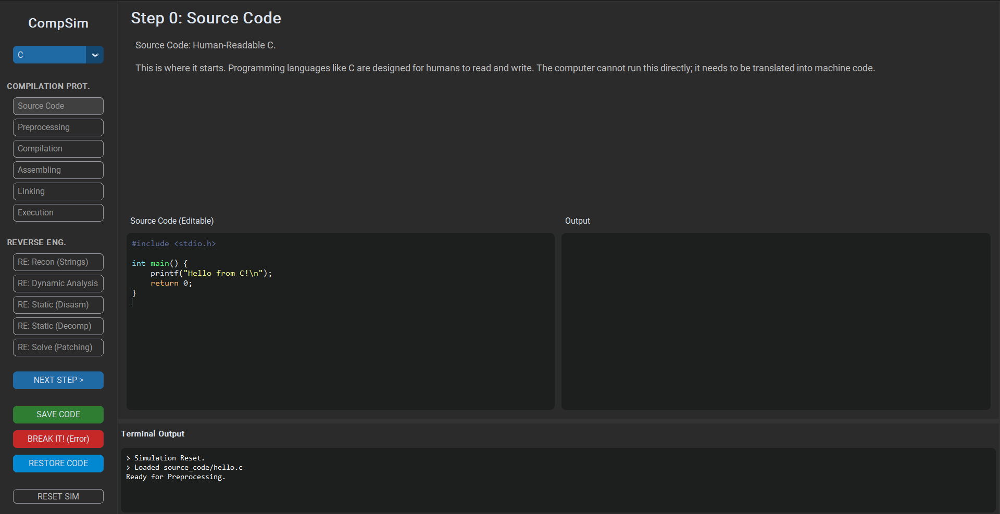

# Compilation Process Simulator

[](https://www.python.org/downloads/)
[](LICENSE)
[]()


A visual, interactive **Educational Tool** designed to demonstrate the lifecycle of C and Java code (from source to execution) and explore the basics of Reverse Engineering. Built for students, educators, and curious developers.

<p align="center">
  
</p>

## ✨ Features

- **Multi-Language Lanes**:
  - **C Lane**: Source ➔ Preprocessing (`.i`) ➔ Compilation (`.s`) ➔ Assembly (`.o`) ➔ Linking (`.exe`).
  - **Java Lane**: Source ➔ Bytecode (`.class`) ➔ JVM Execution.
- **Reverse Engineering Suite**:
  - **Recon**: Extract ASCII strings from compiled binaries.
  - **Disassembly**: View raw CPU opcodes and mnemonics.
  - **Patching**: Hex-edit binaries to alter behavior without recompiling.
- **🛡️ Strict Mode**:
  - Enforces the presence of **Real Tools** (`GCC`, `JDK`).
  - No "mocking" allowed—what you see is actual tool output.
  - Teaches proper environment setup (PATH variables).
- **🚀 Interactive details**:
  - Edit code in real-time.
  - Break code to see compiler errors.
  - Step-by-step visualization of artifacts.

---

## 🛠️ Tech Stack

*   **Core**: [Python 3.10+](https://www.python.org/)
*   **GUI Framework**: [CustomTkinter](https://github.com/TomSchimansky/CustomTkinter)
*   **Syntax Highlighting**: [Pygments](https://pygments.org/)
*   **Backend**: `subprocess` (interacting with GCC/Java)
*   **Build System**: Python Source Distribution

---

## 🚀 Getting Started

### Prerequisites

1.  **Python 3.10+**
2.  **GCC Compiler** (MinGW-w64 recommended for Windows)
3.  **Java JDK 17+**

### 📥 Installation

> **[📖 Click here for the TECHNICAL MANUAL (Deep Dive)](TECHNICAL_MANUAL.md)**

1.  **Clone the repository**
    ```bash
    git clone https://github.com/zis3c/Compilation-and-RE-Process.git
    cd Compilation-and-RE-Process/simulator
    ```

2.  **Install Dependencies**
    ```bash
    pip install -r requirements.txt
    ```

3.  **Setup Environment**
    *   Ensure `gcc` and `javac` are accessible in your Command Prompt.
    *   The app runs in **Strict Mode** and will alert you if they are missing.

### ▶️ Running Locally

```bash
python main.py
```

---

## 🐛 Troubleshooting

*   **"GCC/Java not found" error?**
    *   Add your `bin` folders to the Windows System PATH.
    *   Restart your terminal after installing compilers.
*   **Window not showing?**
    *   Ensure you have installed `customtkinter`.
*   **Subprocess errors?**
    *   The app suppresses console windows automatically. If you see crashes, check the `TECHNICAL_MANUAL.md`.

---

## 🤝 Contributing

Contributions are welcome! Please feel free to submit a Pull Request.

1.  Fork the project
2.  Create your feature branch (`git checkout -b feature/AmazingFeature`)
3.  Commit your changes (`git commit -m 'Add some AmazingFeature'`)
4.  Push to the branch (`git push origin feature/AmazingFeature`)
5.  Open a Pull Request

---

## 📄 License

This project is licensed under the MIT License - see the [LICENSE](LICENSE) file for details.

---

<center>Built with ❤️ by <b>@zis3c</b></center>
